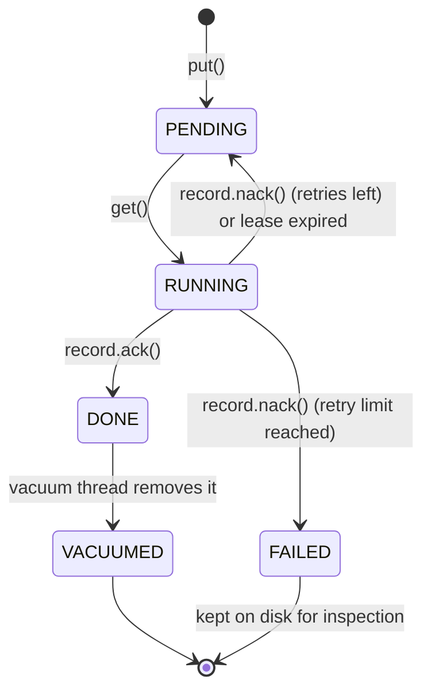

# User Guide

lmdb-queue is a **persistent job queue** for Python. Jobs survive restarts. Workers run in threads or separate processes on the same machine. No external broker required.

For full behaviour rules and test contracts, see the [RFC](rfc.md).

---

## Installation

```bash
pip install lmdb-queue
```

```bash
uv add lmdb-queue
```

---

## Quick start

```python
from equeue import Queue

with Queue("./myqueue") as q:
    q.put({"task": "send_email", "to": "user@example.com"})

    record = q.get(timeout=5.0)
    try:
        send(record.payload)
        record.ack()
    except Exception:
        record.nack()
```

`get()` returns a **Record**. Only that record can call `ack()` or `nack()`. Finishing a job requires holding the record, not just the `job_id`. This prevents one worker from completing a job that belongs to another worker.

### Context manager

```python
with Queue("./myqueue") as q:
    with q.processing(timeout=5.0) as record:
        send(record.payload)
```

Success → `record.ack()`. Exception → `record.nack()`.

### Async

```python
from equeue import AsyncQueue

async with AsyncQueue("./myqueue") as q:
    await q.put({"task": "send_email"})
    async with q.processing() as record:
        await handle(record.payload)
```

Blocking work runs in a thread pool so the event loop stays free.

---

## The Record

| Field | Meaning |
| --- | --- |
| `payload` | Your job data |
| `job_id` | ID for logs and metrics |
| `retries` | Times this job failed before |
| `enqueued_at` | Unix time when the job was added |

Each record carries a hidden **claim token**. When `ack()` or `nack()` is called, the queue checks that token against the one stored on disk. If the lease expired and another worker claimed the job, the old record raises `QueueCorrupted` instead of silently marking the wrong job done.

---

## Configuration

```python
q = Queue(
    "./myqueue",
    lease_time=30.0,        # seconds before a running job can be re-queued
    max_retries=3,          # nacks before FAILED
    map_size=2**30,         # LMDB virtual size (bytes)
    sync=False,             # fsync every write
    do_recover=True,        # background lease recovery
    recover_interval=15.0,
    do_vacuum=True,         # background cleanup of DONE jobs
    vacuum_interval=300.0,
)
```

| Option | Default | Meaning |
| --- | --- | --- |
| `lease_time` | `30.0` | How long a worker may hold a job before recovery can re-queue it |
| `max_retries` | `3` | Nacks before FAILED (`max_retries + 1` total nack attempts) |
| `map_size` | `1 GiB` | LMDB address space (not the same as disk used) |
| `sync` | `False` | If `True`, every write waits for disk sync (slower, safer) |
| `do_recover` | `True` | Turn on the lease recovery thread |
| `recover_interval` | `15.0` | Seconds between recovery scans |
| `do_vacuum` | `True` | Turn on cleanup of old DONE jobs |
| `vacuum_interval` | `300.0` | Seconds between vacuum runs |

---

## Job lifecycle



---

## Statistics

```python
q.stats()
# {
#     "pending":   4,
#     "running":   1,
#     "done":    120,
#     "failed":    2,
#     "total":   127,
# }
```

| Field | Meaning |
| --- | --- |
| `pending` | Jobs waiting to be picked up |
| `running` | Jobs currently held by a worker |
| `done` | Jobs finished successfully (not yet vacuumed) |
| `failed` | Jobs that reached the retry limit |
| `total` | All jobs ever added; never decreases, survives restarts |

All counters are stored on disk. Reading `stats()` never scans the database; it is always fast.

---

## Exceptions

```python
from equeue import QueueEmpty, QueueClosed, QueueCorrupted
```

| Exception | When |
| --- | --- |
| `QueueEmpty` | `get(timeout=…)` found no job in time |
| `QueueClosed` | Queue was closed |
| `QueueCorrupted` | Invalid ack/nack, wrong claim token, or broken data on disk |

---

## Closing the queue

```python
with Queue("./myqueue") as q:
    ...
```

Or manually: `q.close()`. Safe to call more than once.

---

## Important things to know

!!! warning "At-least-once delivery"
    A job may run **more than once**. If a worker crashes or its lease expires before `ack()`, another worker may get the same job. Design handlers so running twice is safe (idempotent).

!!! warning "Multi-process polling"
    Multiple processes can open the same queue path safely. However, processes that are in separate machines cannot share the queue. Cross-process workers poll LMDB at `poll_interval` (default 10 ms).

!!! warning "Durability vs speed"
    With `sync=False` (default), a power loss right after a write may lose the last jobs. Use `sync=True` when you need stronger durability and can accept lower throughput.

!!! note "map_size is not disk usage"
    `map_size` reserves virtual memory address space. LMDB grows on disk as you add data. Setting a large `map_size` does not allocate that much disk up front.

!!! note "Lease time and recovery"
    If a worker holds a job longer than `lease_time` without acking, recovery may put the job back on the queue. Another worker can pick it up. The first worker's record will fail if it tries to ack later (`QueueCorrupted`).

!!! note "Payload types"
    Values must be msgpack-serializable: dicts, lists, strings, numbers, bytes, `None`, etc. Custom Python classes need your own encoding or plain dicts.

!!! note "Not Kafka, not Redis"
    EQueue is an embedded queue for one app on one machine. It does not replace distributed brokers.

---

## Further reading

- [RFC](rfc.md): architecture, claim tokens, and the full contract list used by tests

Run contract tests locally:

```bash
pytest -m contract -v
pytest -m rfc_rec_01 -v   # single rule, example
```
