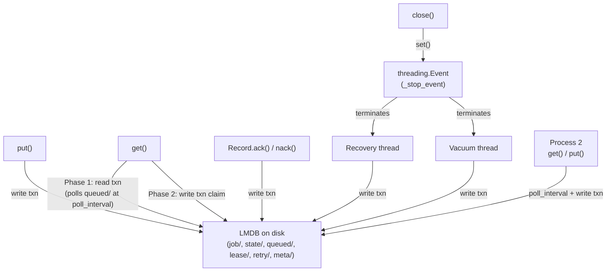
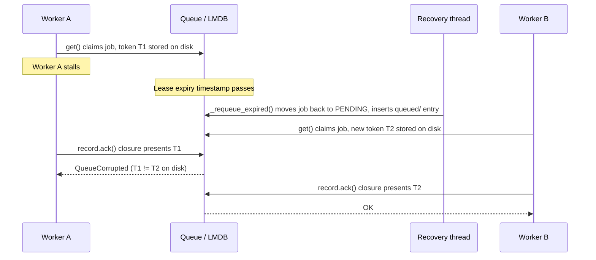
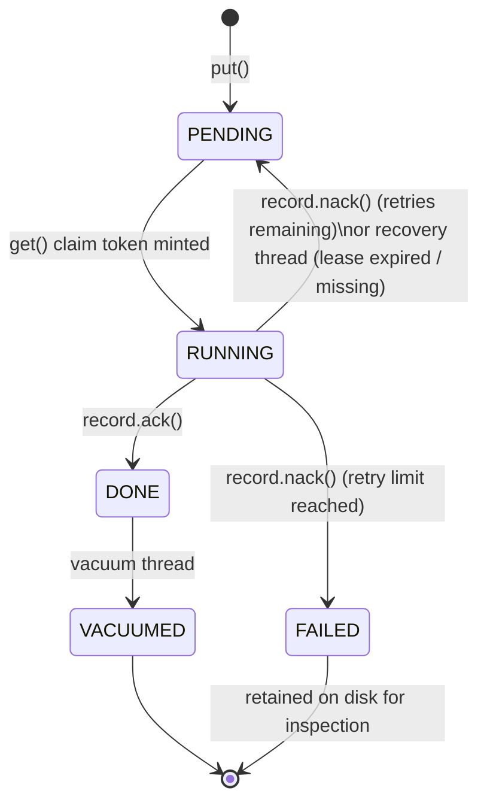

# RFC: EQueue

**Status:** DRAFT  
**Version:** 2.0

This document is the reference for EQueue behaviour. Each rule has a stable ID (for example `RFC-REC-01`). 
Contract tests use those IDs as markers so a failure identifies exactly which rule was violated.

---

## 1. What is EQueue?

EQueue is a **persistent job queue** for a **single machine**. Jobs are stored on disk (LMDB). There is no Redis, RabbitMQ, or other external service.

The queue provides **at-least-once delivery**: a job may be delivered more than once if a worker crashes or its lease expires. Handlers must be **idempotent**.

### When to use

Good fit:

- Background workers inside one app (threads or processes on the same machine)
- CLI tools and scripts
- Threaded or multi-process servers.

Not a fit:

- Distributed workers across machines
- Pub/sub or streaming at huge scale

---

## 2. Pillars

| Idea | What it means |
| --- | --- |
| Disk is the source of truth | Every job state change is written to LMDB **before** memory is updated. |
| `queued/` index for coordination | A sorted `queued/<job_id>` key space in LMDB is the authoritative list of claimable jobs. It is written atomically with every state transition and is visible to all processes sharing the path. |
| Uniform polling | All callers (threads in the same process and separate processes) discover new jobs by polling the `queued/` index at `poll_interval` (default 10 ms). A `threading.Event` (`_stop_event`) is used only to signal background threads to stop on `close()`. |
| Blocking API | Calls like `put()` and `get()` block the caller. |
| Fail loudly | Invalid operations raise `QueueCorrupted`. The queue must not silently break counters or state. |
| Record owns completion | Job completion is performed through the `Record` returned by `get()`, not by passing a bare job ID. |

---

## 3. Architecture



On startup, the queue reads LMDB and rebuilds counters. The `queued/` index is the authoritative list of claimable jobs and is shared across all processes that open the same LMDB path.

### Two-phase `get()`

`get()` is split into two phases to keep LMDB write-lock contention minimal:

1. **Read phase**: Open a read-only transaction and seek to the `queued/` prefix. Read transactions never block writers and run in parallel. If no entry is found, release the transaction, sleep for `poll_interval` (default 10 ms), then retry. This polling loop is used uniformly by both intra-process threads and cross-process instances.
2. **Claim phase**: Open a write transaction, re-verify the job is still `PENDING` (another worker may have claimed it since the read), atomically remove its `queued/` entry, write `state/ = RUNNING`, and write the lease with a new claim token.

The re-verification in Phase 2 is mandatory. It resolves the race where two workers both saw the same job in their Phase 1 snapshots: the second writer finds the state already `RUNNING` and retries Phase 1.

---

## 4. `Record`

`get()` returns a `Record`, similar to a Kafka consumer record. It holds all data required to process the job:

| Field | Meaning |
| --- | --- |
| `payload` | Job payload |
| `job_id` | Stable ID (for logs and metrics) |
| `retries` | How many times this job was nacked before |
| `enqueued_at` | When the job was first added |

Completion is always on the record:

```python
record = queue.get()
try:
    do_work(record.payload)
    record.ack()
except Exception:
    record.nack()
```

There is **no** `queue.ack(job_id)`. Knowing the integer ID is not enough and is unsafe.

### Claim token

When `get()` is invoked, the queue:

1. Marks the job as **RUNNING**
2. Creates a random 128-bit **claim token**
3. Stores token + lease expiry on disk
4. Captures the token inside a completion closure bound to the returned `Record`. The token is never exposed as a public field.

When `record.ack()` or `record.nack()` is invoked, the closure calls `_finish` with the captured token, which the queue verifies **matches** the token stored on disk.

If a lease expires and another worker claims the same job, that worker receives a **new** token. The old record no longer matches the token on disk, so calling `ack()` raises `QueueCorrupted`. This prevents one worker from completing a job that another worker now holds.



---

## 5. Job states



| State | Meaning |
| --- | --- |
| PENDING | Waiting for a worker; entry present in `queued/` index |
| RUNNING | Claimed by a worker; lease and claim token active |
| DONE | Finished successfully; payload retained until vacuum runs |
| FAILED | Exceeded retry limit; payload retained permanently for inspection |

Only a **RUNNING** job with a **matching claim token** can be acked or nacked.

---

## 6. Operations

### `put(item)`

Within one write transaction: writes payload and state to disk and inserts a `queued/<job_id>` entry. Returns `job_id`. Waiting `get()` callers discover the new entry on their next poll cycle.

### `get(timeout)`

Executes the two-phase claim described in section 3. Blocks until a job is available or `timeout` expires. Returns a `Record`. All callers (threads and separate processes) discover jobs by polling the `queued/` index at `poll_interval` (default 10 ms).

### `record.ack()`

Marks job DONE. Keeps payload on disk for stats and cleanup. Removes lease and retry data.

### `record.nack()`

Increments the retry count. If the retry limit is not reached, the job goes back to PENDING. If the retry limit is exceeded, the job is marked FAILED.

### `max_retries`

Counts **nack calls before FAILED**:

| `max_retries` | Maximum nack attempts before FAILED |
| --- | --- |
| 0 | 1 nack marks job FAILED |
| 1 | 2 nacks mark job FAILED |
| 3 | 4 nacks mark job FAILED |

Rule: failed when `retry_count + 1 > max_retries`.

### Recovery

A background thread finds RUNNING jobs whose lease expired (or is missing) and puts them back to PENDING. Recovery MUST:

1. Scan `state/` for RUNNING jobs with no lease key (not only `lease/` entries).
2. Write `state/ = PENDING` and insert `queued/<job_id>` in the same write transaction.
3. Be **idempotent**: running it twice MUST NOT produce duplicate `queued/` entries or duplicate counter increments.

### Vacuum

A background thread deletes old DONE jobs from disk to save space. FAILED jobs are kept for inspection. Each deletion should lower the `done` counter in `stats()`.

### `close()`

Sets `_stop_event` (a `threading.Event`), which causes the recovery and vacuum background threads to exit their loops. Then joins the threads, syncs disk, and closes LMDB. Safe to call twice.

---

## 7. Errors

| Exception | When |
| --- | --- |
| `QueueEmpty` | `get(timeout=...)` timed out with no job |
| `QueueClosed` | Queue was closed |
| `QueueCorrupted` | Wrong state, wrong token, double ack, missing data on disk |

---

## 8. Integrity and security invariants

The properties below are **mandatory**. Any violation indicates wrong behaviour. Identifiers use the `RFC-INV-` prefix.

These invariants enforce:

- **Accounting integrity**: Counters and lifecycle states remain consistent and auditable.
- **Index consistency**: The `queued/` index MUST be a faithful projection of `state/ = PENDING`; divergence between the two is corruption.
- **Lease enforcement**: Expired or orphaned RUNNING jobs cannot block the queue indefinitely.
- **Completion authorization**: A job MUST NOT transition to DONE without a valid, matching claim token (see RFC-INV-04 and RFC-REC-*).
- **Deterministic failure**: Invalid operations MUST surface as `QueueCorrupted`, not silent state mutation.

| ID | Requirement |
| --- | --- |
| **RFC-INV-01** | `stats()["total"]` MUST equal the number of successful `put()` operations since queue creation, including across process restarts. |
| **RFC-INV-02** | The inequality `pending + running + done + failed <= total` MUST hold at all times. Equality holds when no DONE jobs have been vacuumed. |
| **RFC-INV-03** | Upon completion of recovery, no RUNNING job MUST retain an expired or absent lease. |
| **RFC-INV-04** | A second `ack()` on the same record MUST raise `QueueCorrupted`; duplicate completion MUST NOT be accepted silently. |
| **RFC-INV-05** | After exactly `max_retries + 1` nack operations, the job MUST enter FAILED state with `retry_count == max_retries + 1`. |
| **RFC-INV-06** | Upon completion of vacuum, no DONE job MUST retain records under `job/` or `state/`. |
| **RFC-INV-07** | Repeated invocation of `close()` MUST NOT raise an exception. |
| **RFC-INV-08** | Every state transition to PENDING MUST atomically insert a `queued/<job_id>` entry in the same write transaction. Every transition away from PENDING MUST atomically remove it. The `queued/` index and `state/` MUST never be out of sync. |
| **RFC-INV-09** | `_recover()` MUST be idempotent: invoking it twice on the same database MUST NOT produce duplicate `queued/` entries, duplicate counter increments, or any other observable side-effect beyond the first invocation. |

!!! important "Conformance"
    Implementations MUST satisfy every invariant in this section. Related contract tests in section 9 (for example `rfc_st_03`, `rfc_rc_01`, `rfc_id_01`, `rfc_rt_01`, `rfc_sh_01`, `rfc_mp_03`, `rfc_mp_04`) provide automated verification where applicable. A failing invariant test blocks release until the defect is resolved or this RFC is adjusted.

---

## 9. Contract registry

Each row is enforced by a test. Run one contract:

```bash
pytest -m rfc_rec_01 -v
```

Run all contracts:

```bash
pytest -m contract -v
```

### State machine (`RFC-SM-*`)

| ID | Rule | Test | Marker |
| --- | --- | --- | --- |
| **RFC-SM-01** | Cannot complete a job that is still PENDING. | `test_ack_requires_running_state` | `rfc_sm_01` |
| **RFC-SM-02** | Cannot nack a job that is still PENDING. | `test_nack_requires_running_state` | `rfc_sm_02` |
| **RFC-SM-03** | Cannot nack a job that is already FAILED. | `test_nack_on_failed_is_rejected` | `rfc_sm_03` |

### Record and claim token (`RFC-REC-*`)

| ID | Rule | Test | Marker |
| --- | --- | --- | --- |
| **RFC-REC-01** | Stale record cannot ack after another worker re-claimed the job. | `test_stale_record_after_reclaim_is_rejected` | `rfc_rec_01` |
| **RFC-REC-02** | Wrong claim token raises `QueueCorrupted`. | `test_wrong_token_raises_queue_corrupted` | `rfc_rec_02` |

### Idempotency (`RFC-ID-*`)

| ID | Rule | Test | Marker |
| --- | --- | --- | --- |
| **RFC-ID-01** | Second `ack()` on same record raises `QueueCorrupted`. | `test_double_ack_raises_queue_corrupted` | `rfc_id_01` |
| **RFC-ID-02** | `ack()` after vacuum removed the job raises `QueueCorrupted`. | `test_ack_after_vacuumed_job_raises` | `rfc_id_02` |

### Retries (`RFC-RT-*`)

| ID | Rule | Test | Marker |
| --- | --- | --- | --- |
| **RFC-RT-01** | Job fails after `max_retries + 1` nacks with correct retry count on disk. | `test_failed_after_max_retries_plus_one_nacks` | `rfc_rt_01` |
| **RFC-RT-02** | Each re-queue nack increments retry count by 1. | `test_requeue_increments_retry_counter` | `rfc_rt_02` |

### Persistence and vacuum (`RFC-PS-*`)

| ID | Rule | Test | Marker |
| --- | --- | --- | --- |
| **RFC-PS-01** | `ack()` keeps payload and DONE state on disk. | `test_ack_keeps_payload_and_state_in_lmdb` | `rfc_ps_01` |
| **RFC-PS-02** | Vacuum removes DONE jobs only; FAILED jobs stay. | `test_vacuum_removes_done_records_only` | `rfc_ps_02` |
| **RFC-PS-03** | Vacuum lowers `stats()["done"]` for each removed job. | `test_vacuum_decrements_done_counter` | `rfc_ps_03` |

### Recovery (`RFC-RC-*`)

| ID | Rule | Test | Marker |
| --- | --- | --- | --- |
| **RFC-RC-01** | After `recover()`, no RUNNING job has a bad lease. | `test_no_expired_running_leases_after_recover` | `rfc_rc_01` |
| **RFC-RC-02** | Recovery thread fixes RUNNING jobs even when lease key is missing. | `test_running_without_lease_recovered_by_daemon` | `rfc_rc_02` |

### Claim safety (`RFC-CL-*`)

| ID | Rule | Test | Marker |
| --- | --- | --- | --- |
| **RFC-CL-01** | Missing payload on disk raises `QueueCorrupted`, not a crash. | `test_claim_on_missing_payload_raises_queue_corrupted` | `rfc_cl_01` |

### Statistics (`RFC-ST-*`)

| ID | Rule | Test | Marker |
| --- | --- | --- | --- |
| **RFC-ST-01** | `stats()` returns all documented keys. | `test_stats_exposes_all_documented_keys` | `rfc_st_01` |
| **RFC-ST-02** | No stat counter goes negative. | `test_counters_never_negative` | `rfc_st_02` |
| **RFC-ST-03** | Lifecycle counts never exceed `total`. | `test_lifecycle_sum_never_exceeds_total`, `test_lifecycle_invariant_holds_after_vacuum_and_reopen` | `rfc_st_03` |

### Shutdown (`RFC-SH-*`)

| ID | Rule | Test | Marker |
| --- | --- | --- | --- |
| **RFC-SH-01** | `close()` twice is safe. | `test_close_is_idempotent` | `rfc_sh_01` |
| **RFC-SH-02** | Operations after close raise `QueueClosed`. | `test_operations_after_close_raise_queue_closed` | `rfc_sh_02` |

### Multi-process (`RFC-MP-*`)

| ID | Rule | Test | Marker |
| --- | --- | --- | --- |
| **RFC-MP-01** | A job enqueued by one `Queue` instance is retrievable by a separate instance opening the same path, after the poll interval elapses or recovery runs. | `test_cross_instance_put_get_works` | `rfc_mp_01` |
| **RFC-MP-02** | Concurrent `get()` calls from two instances on the same path claim each job exactly once; no job is delivered to both. | `test_concurrent_claim_delivers_each_job_exactly_once` | `rfc_mp_02` |
| **RFC-MP-03** | After any crash-recovery scenario, the `queued/` index MUST be consistent with `state/`: every PENDING job has an entry and no non-PENDING job does. | `test_queued_index_is_consistent_with_state_after_recovery` | `rfc_mp_03` |
| **RFC-MP-04** | `_recover()` is idempotent: invoking it twice MUST NOT insert duplicate `queued/` entries or double-increment counters. | `test_recover_is_idempotent_across_instances` | `rfc_mp_04` |

---

## 10. Writing tests

Tag each contract test with its RFC marker and mention the ID in the docstring:

```python
@pytest.mark.rfc_sm_01
def test_ack_requires_running_state(self, quiet_queue: Queue) -> None:
    """RFC-SM-01: cannot complete a PENDING job."""
    ...
```

If a contract test fails, the implementation must be corrected unless the RFC is being revised intentionally.

